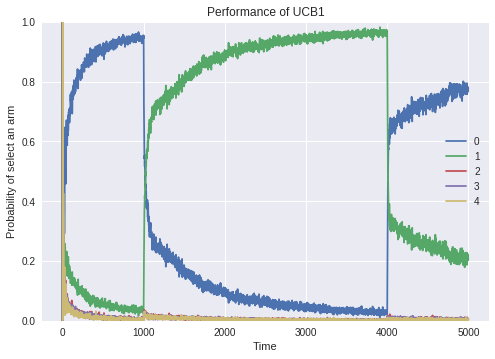
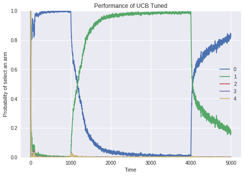
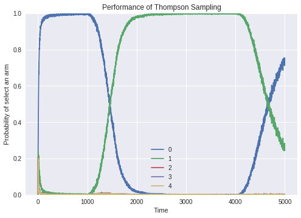
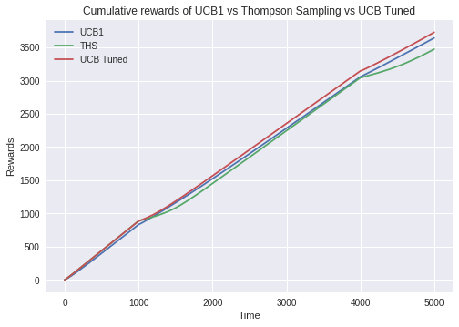
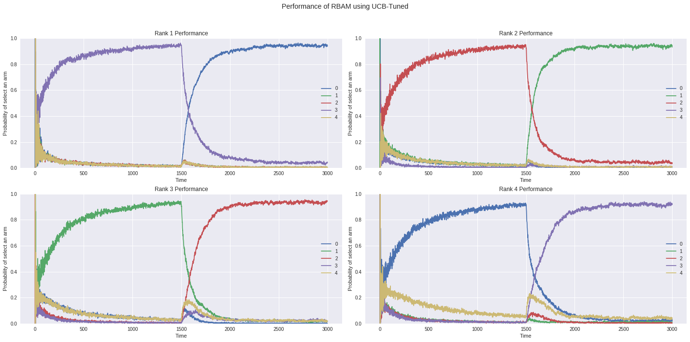
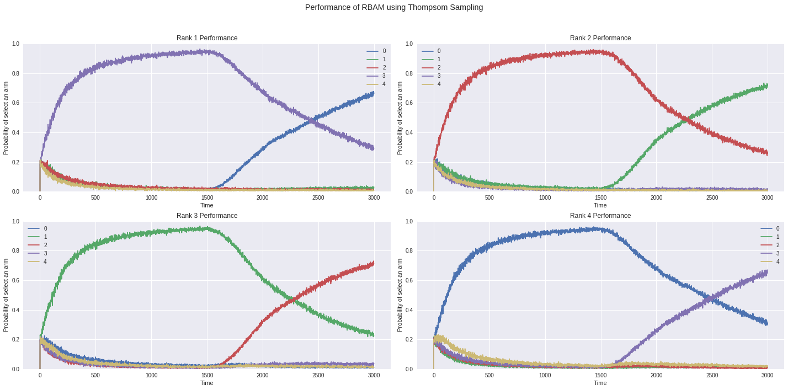
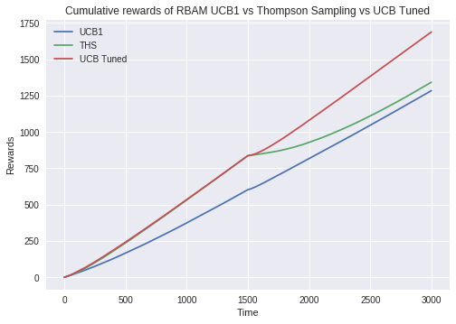

# Multi-Armed Bandit Algorithms (MAB)
Multi-Armed Bandit (MAB) is a problem in which a fixed limited set of resources must be allocated between competing (alternative) choices in a way that maximizes their expected gain, when each choice's properties are only partially known at the time of allocation, and may become better understood as time passes or by allocating resources to the choice.

In the problem, each machine provides a random reward from a probability distribution specific to that machine. The objective of the gambler is to maximize the sum of rewards earned through a sequence of lever pulls. The crucial tradeoff the gambler faces at each trial is between "exploitation" of the machine that has the highest expected payoff and "exploration" to get more information about the expected payoffs of the other machines. The trade-off between exploration and exploitation is also faced in machine learning.

The main problems that the MAB help to solve is the split of the population in online experiments.


## Installing
```
pip install mabalgs
```

## Algorithms (Bandit strategies)

### Non-linear Contextual Bandit Algorithm (ONN_THS)
If you are looking for a contextual bandit algorithm, please go to my another repository [ONN_THS](https://github.com/alison-carrera/onn)

### UCB1 (Upper Confidence Bound)
Is an algorithm for the multi-armed bandit that achieves regret that grows only logarithmically with the number of actions taken, with no prior knowledge of the reward distribution required.

#### Get a selected arm
```python
from mab import algs

# Constructor receives number of arms.
ucb_with_two_arms = algs.UCB1(2)
ucb_with_two_arms.select()
```

#### Reward an arm
```python
from mab import algs

# Constructor receives number of arms.
ucb_with_two_arms = algs.UCB1(2)
my_arm = ucb_with_two_arms.select()[0]
ucb_with_two_arms.reward(my_arm)
```

### UCB-Tuned (Upper Confidence Bound Tuned)
A strict improvement over both UCB solutions can be made by tuning the upper-bound parameter in UCB1’s decision rule. UCB-Tuned empirically outperforms UCB1 and UCB2 in terms of frequency
of picking the best arm. Further, indicate that UCB-Tuned is “not very” sensitive to the variance of the arms. 

#### Get a selected arm
```python
from mab import algs

# Constructor receives number of arms.
ucbt_with_two_arms = algs.UCBTuned(2)
ucbt_with_two_arms.select()
```

#### Reward an arm
```python
from mab import algs

# Constructor receives number of arms.
ucbt_with_two_arms = algs.UCBTuned(2)
my_arm = ucbt_with_two_arms.select()[0]
ucbt_with_two_arms.reward(my_arm)
```

### Thompson Sampling
Thompson Sampling is fully Bayesian: it generates a bandit configuration (i.e. a vector of expected rewards) from a posterior distribution, and then acts as if this was the true configuration (i.e. it pulls the lever with the highest expected reward).

“On the likelihood that one unknown probability exceeds another
in view of the evidence of two samples” produced the first paper on an equivalent problem to the multi-armed bandit in which a solution to the Bernoulli
distribution bandit problem now referred to as Thompson sampling is presented.

#### Get a selected arm
```python
from mab import algs

# Constructor receives number of arms.
thomp_with_two_arms = algs.ThompsomSampling(2)
thomp_with_two_arms.select()
```

#### Reward an arm
```python
from mab import algs

# Constructor receives number of arms.
thomp_with_two_arms = algs.ThompsomSampling(2)
my_arm = thomp_with_two_arms.select()[0]
thomp_with_two_arms.reward(my_arm)
```

## Comparison of the algorithms using Monte Carlo Simulation

Monte Carlo simulation is the best way to debug / test MAB algorithms. This simulation generates data in real time 
respecting a probability of delivery (chosen by the executor of the simulation) over time. 
These probabilities may represent the taste of most users regarding a MAB arm (option) over time, for example.

Example: We want to test a 5-arm MAB that will be used in an ad problem, and MAB must choose which of the 5 ads must
receive the most clicks from users. You can use the following probability setting ([0.9, 0.1, 0.1, 0.1, 0.1]) for this.
Each array element represents an arm and its probability of being clicked.
We can observe that Ad 0 (index 0 of array) has 90% chance of clicks while others have 10% chances of clicks.
These information can help us to analyze if the algorithm is performing well.

A simulation with the following settings was made:

```
{0: [0.9, 0.6, 0.2, 0.2, 0.1], 1000: [0.3, 0.8, 0.2, 0.2, 0.2], 4000: [0.7, 0.3, 0.2, 0.2, 0.1]}
```

The key of the dictionary tells us the time which the probabilities must be activated in the passing time.
The total time of the simulation was 5000 steps and each point of the chart is an average of 1000 simulations with 5000 steps each.

From this dictionary we can infer that:

- From time 0 to 1000, arm 0 is the winner.
- From time 1000 to 4000, arm 1 is the winner
- From time 4000, arm 0 is the winner.

You can check a full example of this simulation at this [notebook.](./Monte_Carlo_Simulation_Example.ipynb)

### Results:









Remembering that all these analyzes were performed in a simulation environment and the results may vary according 
to the type of information the MAB will perform on. For a more sensible choice with real world data, please perform 
an AB test between the algorithms in your scenario.

----------------

# Ranked Multi-Armed Bandit Algorithms

### RBA (Ranked Bandit Algorithm)
This is an online learning algorithm which can be used to the ranking problem. In this algorithm we have a certain quantity of
arms to be shown in a certain quantity of a ranked slots (like a netflix film list). Each arm is best in some of the ranking position and
this algorithm uses MAB instances to do that.

#### Get selected arms in their ranked positions
```python
from mab import algs, ranked_algs

# Constructor receives number of arms, number of ranks and a MAB algorithm reference.
rba_algorithm = ranked_algs.RBA(10, 10, algs.ThompsomSampling) # Any MAB from algs can be used.
ranked_selected_arms = rba_algorithm.select() # Best arms in its best position.
```

#### Reward an arm in a certain position of the rank
```python
from mab import algs, ranked_algs

# Constructor receives number of arms, number of ranks and a MAB algorithm reference.
rba_algorithm = ranked_algs.RBA(10, 10, algs.ThompsomSampling) # Any MAB from algs can be used.
ranked_selected_arms = rba_algorithm.select() # Best arms in its best position.
rba_algorithm.reward(ranked_selected_arms, 2) # Reward the arm 2 in its position of the rank.
```

### RBA-M (Ranked Bandit Algorithm - Modified)
It's the same thing of the RBA, but with a modification in the arm collisions approach.
This new collision approach was made by me and my team partner [Fábio](https://github.com/fabiosvb). For more details about this approach, please see code documentation.

#### Get selected arms in their ranked positions
```python
from mab import algs, ranked_algs

# Constructor receives number of arms, number of ranks and a MAB algorithm reference.
rbam_algorithm = ranked_algs.RBAM(10, 10, algs.ThompsomSampling) # Any MAB from algs can be used.
ranked_selected_arms = rbam_algorithm.select() # Best arms in its best position.
```

#### Reward an arm in a certain position of the rank
```python
from mab import algs, ranked_algs

# Constructor receives number of arms, number of ranks and a MAB algorithm reference.
rbam_algorithm = ranked_algs.RBAM(10, 10, algs.ThompsomSampling) # Any MAB from algs can be used.
ranked_selected_arms = rbam_algorithm.select()  # Best arms in its best position.
rbam_algorithm.reward(ranked_selected_arms, 2) # Reward the arm 2 in its position of the rank.
```

## Behavior of the RBA-M algorithm using Monte Carlo Simulation

Like before, we will make a Monte Carlo experimentation using RBA-M Algorithm to show its behavior.

Example: We want to test a 5-arm and 4-rank MAB that will be used in a movie slot recomendation problem, 
and MAB must choose which of the 4 movies banners must receive the most clicks from users in each slot position.

A simulation with the following settings was made:

```
{
    0: [[0.1, 0.1, 0.1, 0.9, 0.1],
        [0.1, 0.1, 0.9, 0.1, 0.1], 
        [0.1, 0.9, 0.1, 0.1, 0.1], 
        [0.9, 0.1, 0.1, 0.1, 0.1], 
        [0.25, 0.25, 0.25, 0.25]], # Rank position click probability.
                        
    1500: [[0.9, 0.1, 0.1, 0.1, 0.1], 
           [0.1, 0.9, 0.1, 0.1, 0.1], 
           [0.1, 0.1, 0.9, 0.1, 0.1], 
           [0.1, 0.1, 0.1, 0.9, 0.1], 
           [0.25, 0.25, 0.25, 0.25]] # Rank position click probability.
           
} 
```

In this simulation we have something different. Now, at a given time we need to set the probability of all available arms in each position of the rank, and
the last array is the rank position click probability (velocity of convergence at given ranking position).

The total time of the simulation was 3000 steps and each point of the chart is an average of 1000 simulations with 3000 steps each.

From this dictionary we can infer that:

- From time 0 to 1500, arm 3 is the winner at rank 0, arm 2 is the winner at rank 1, arm 1 is the winner at rank 2 and arm 0 is the winner at rank 3.
- From time 1500 to 3000, arm 0 is the winner at rank 0, arm 1 is the winner at rank 1, arm 2 is the winner at rank 2 and arm 3 is the winner at rank 3.
- The Rank position click probability is the same to all to give a better understanding of their behaviors.

You can check a full example of this simulation at this [notebook.](./Monte_Carlo_RBAM.ipynb)

### Results:








Remembering that all these analyzes were performed in a simulation environment and the results may vary according 
to the type of information the RMAB will perform on. For a more sensible choice with real world data, please perform 
an AB test between the algorithms in your scenario.

### RBA vs RBA-M

If you want to see the behavior of the RBA algorithm, you can execute it using this [notebook.](./Monte_Carlo_RBAM.ipynb) It's just change the 'rbam' to 'rba' in the run method. The behavior between they is the same, just in the 'same weight' case for arms in same positions is that RBA-M performs better.

----------------

## Contributors
- [Alison de Andrade Carrera](https://github.com/alison-carrera)
- [Fábio Silva Vilas Boas](https://github.com/fabiosvb)
- [Daniel Araújo](https://github.com/danielcoaraujo)

## References
- [Wikipedia MAB](https://en.wikipedia.org/wiki/Multi-armed_bandit)
- [A Survey of Online Experiment Design
with the Stochastic Multi-Armed Bandit](https://arxiv.org/pdf/1510.00757.pdf)
- [Finite-time Analysis of the Multiarmed Bandit Problem](https://link.springer.com/article/10.1023%2FA%3A1013689704352?LI=true)
- [Solving multiarmed bandits: A comparison of epsilon-greedy and Thompson sampling](https://towardsdatascience.com/solving-multiarmed-bandits-a-comparison-of-epsilon-greedy-and-thompson-sampling-d97167ca9a50)
- [Learning Diverse Rankings with Multi-Armed Bandits](https://dl.acm.org/citation.cfm?id=1390255)
